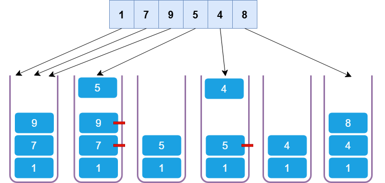
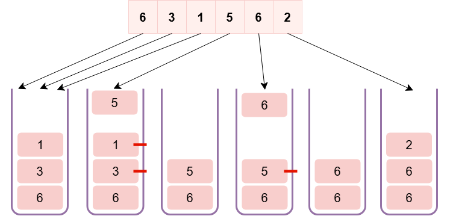
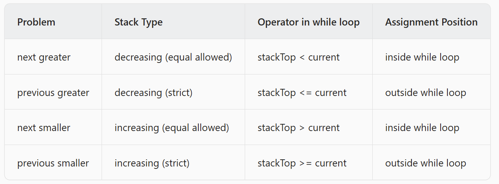

Definition
-------------------------------

A Monotonic Stack is a special kind of stack, which maintains its elements in a specific order. Unlike a traditional stack, where elements are placed on top of one another 
based on when they arrive, **a Monotonic Stack ensures that the elements inside the stack remain in an increasing or decreasing order. This is achieved by enforcing specific 
push and pop rules, depending on whether we want an increasing or decreasing monotonic stack**.

Monotonic Stacks are powerful tools in coding interviews due to their unique capabilities. They are particularly effective when it comes to problems requiring us to find the 
next smaller or larger element in a sequence, often referred to as **Next Greater Element (NGE) or Next Smaller Element (NSE) problem**

Monotonic Stacks are typically useful when dealing with problems that involve analyzing sequences or arrays, **if you encounter a problem where the solution seems to require 
some sort of sequential step-by-step comparison, it's likely a good candidate for using a Monotonic Stack**.

Monotonically Increasing Stack
-------------------------------
A Monotonically Increasing Stack is 
1. **A stack where elements are arranged in an ascending order from the bottom to the top**.
2. **Every new element that's pushed onto the stack is greater than or equal to the element below it**.
3. **If a new element is smaller, we pop the elements from the top of the stack until we find an element smaller than or equal to the new element**, **or the stack is empty**.



Monotonically Decreasing Stack
-------------------------------
A Monotonically Decreasing Stack is 
1. **A stack where elements are arranged in a descending order from the bottom to the top.** 
2. **When a new element arrives, if it's larger than the element on the top, we keep popping the elements from the stack until we find an element that's larger than or equal to the new element, or the stack is empty.** 



Four types of monotonic stacks
--------------------------------


| Term                          | Definition                                                         | Allowed Duplicates?    | Example            |
|-------------------------------|--------------------------------------------------------------------|------------------------|--------------------|
| Strictly Increasing            | Each element is greater than the previous one.                     | No duplicates allowed. | [1, 2, 3, 4, 5]    |
| Non-decreasing (Weakly Increasing) | Each element is greater than or equal to the previous one.        | Duplicates allowed.    | [1, 2, 2, 3, 4, 5] |
| Strictly Decreasing            | Each element is smaller than the previous one.                     | No duplicates allowed. | [5, 4, 3, 2, 1]    |
| Non-increasing (Weakly Decreasing) | Each element is smaller than or equal to the previous one.        | Duplicates allowed.    | [5, 5, 4, 3, 1]    |

Key Differences:
----------------

**Strictly Increasing vs Non-decreasing**: The strictly increasing sequence does not allow duplicates, whereas the non-decreasing sequence allows elements to stay the same between consecutive positions (i.e., duplicates are allowed).

**Strictly Decreasing vs Non-increasing**: The strictly decreasing sequence does not allow duplicates and forces each element to be smaller than the previous element, while the non-increasing sequence allows elements to stay the same (duplicates are allowed) as long as they do not increase.

Practical Use Cases:
--------------------

Strictly Increasing: Useful when you want to ensure that the values progress without repetition, such as in time-series data where you're tracking increasing measurements (e.g., stock prices).

Non-decreasing: Often used in situations where the values can stay the same but should not decrease, like in sorting algorithms or in tracking cumulative totals.

Strictly Decreasing: Used in scenarios where a value must decrease over time without any flat spots or duplicates, such as decay processes or countdowns.

Non-increasing: Used when values can either stay the same or decrease, such as in reverse sorting or in systems where measurements are guaranteed to decrease or stabilize.

A generic template
------------------

```
function buildMonoStack(arr) {
  // initialize an empty stack
  stack = [];
  
  // iterate through all the elements in the array
  for (i = 0 to arr.length - 1)) {
    while (stack is not empty && element represented by stack top `OPERATOR` arr[i]) {
      // if the previous condition is satisfied, we pop the top element
      let stackTop = stack.pop();
  
      // do something with stackTop here e.g.
      // nextGreater[stackTop] = i
    }
  
    if (stack.length) {
      // if stack has some elements left
      // do something with stack top here e.g.
      // previousGreater[i] = stack.at(-1)
    }

    // at the ened, we push the current index into the stack
     stack.push(i);
  }
  
  // At all points in time, the stack maintains its monotonic property
}
```

**Notes about the template above**

* We initialize an empty stack at the beginning.
* The stack contains the index of items in the array, not the items themselves
* There is an outer for loop and inner while loop.
* At the beginning of the program, the stack is empty, so we don't enter the while loop at first.
* The earliest we can enter the while loop body is during the second iteration of for loop. That's when there is at least an item in the stack.
* At the end of the while loop, the index of the current element is pushed into the stack
* The OPERATOR inside the while loop condition decides what type of monotonic stack are we creating.
* The OPERATOR could be any of the four - >, >=, <, <=

**Time complexity** - It can be argued that no element is accessed more than four times (a constant) - one, when comparing its value with the item in the stack (while conditional). two, when pushing the item in the stack. three, when comparing this item in the stack with the current item being iterated (while conditional again). four, when popping the item out of stack. As a result, the time complexity of this algorithm is linear. - O(n) where n is the number of elements in the array.

**Space complexity** - Because we are using an external data structure - stack. In the worst can it can be filled with all the elements in the array. The space complexity is also linear. - O(n) where n is the number of elements in the array.

In our implementation, finding next greater and previous greater elements require building a monotone decreasing stack. For finding next smaller and previous smaller requires building a monotone increasing stack. To help you remember this, think of this as an inverse relation - **greater requires decreasing, smaller requires increasing stacks**.



Reference: https://leetcode.com/discuss/post/2347639/A-comprehensive-guide-and-template-for-monotonic-/


