Reverse a LinkedList
---------------------

So we are really just going from this:
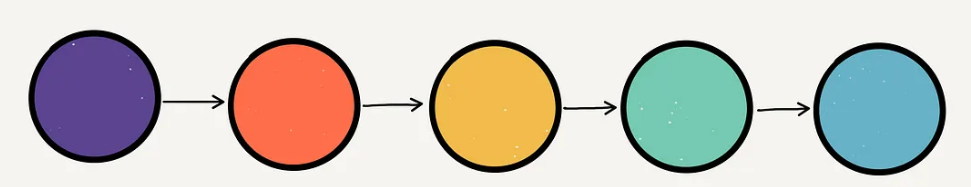
To this:
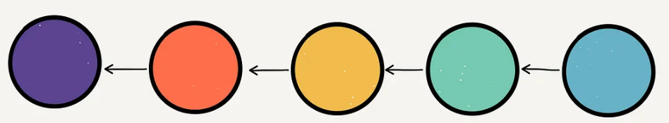

Let’s look at what happens on an individual node level:
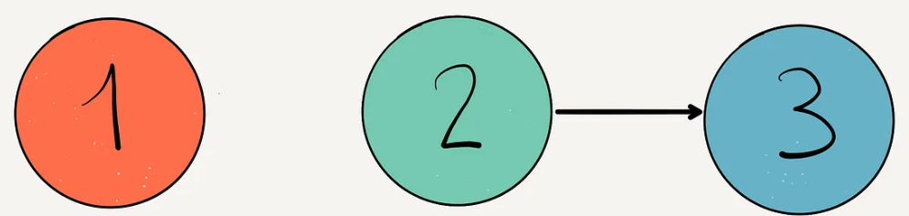

To do a reassignment on a single node (in this example it will be the 2 node) we just need two variables, 
let’s call them previous , current . And all we’re doing is taking current.next (which is represented by the arrow) 
and setting it equal to previous .
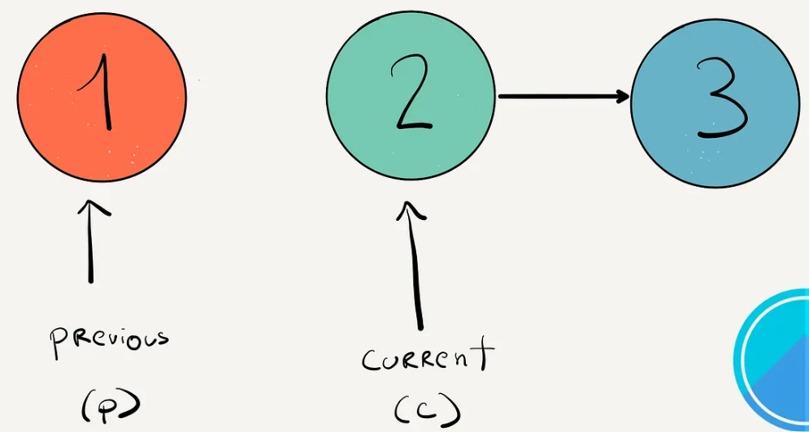
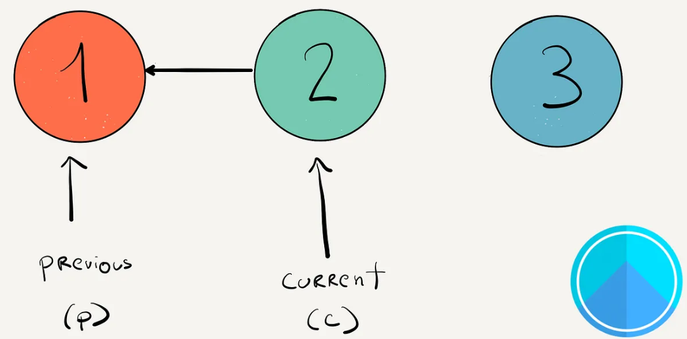

But now we’ve lost our reference to the node the current was originally pointing to. So to make sure we don’t lose track of that node, 
we need a third variable: following . This has to be set BEFORE we do the reassignment.
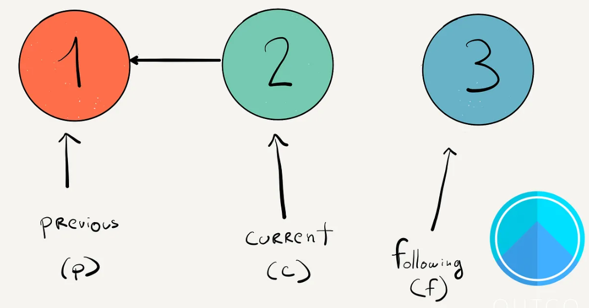


This lays out the basic mechanics of pointer reassignment, now let’s start to look at how this works on the list as a whole.

Because we need to repeat this process throughout the entire list if we want to fully reverse it. We can do this by moving each of those variables up through the list, from front to back, after each reassignment. We just have to be careful in our order of operations.

There are four tricky pieces to all this:

1.Knowing what to assign the variables to initially.
2.Knowing when to end this process of reassignments.
3.Making sure the order of operations is correct so we don’t lose track of any nodes.
Returning the correct value.

Let’s start with the first point. Initially, we want both the current and the following equal to the head that is given as the input.

This is because we can’t assume the length of the linked list. What if head was null and we’re looking at an empty list?

```
function reverse(head) {
// Step 1
let previous = null
let current = head
let following = head
}
```
If we do have at least one node in our list, we will end up assigning our following variable to whatever comes next, but we first need to be sure we have at least one.

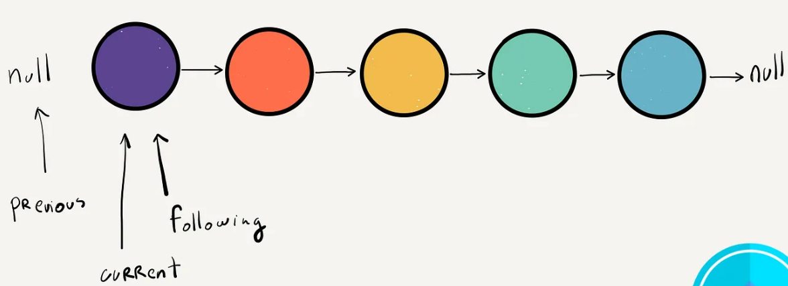
Which brings us to our next point, how long do we keep running our reassignment algorithm? Or put another way, how do we know when to end this series of reassignments?

Well if your goal is to look at EVERY node, and reassign its next property to whatever came before it, we need to make sure that our current variable is assigned once to every node. This means doing a linear scan through the list, starting at the head.

Eventually though, it will reach the last node’s next, which ALWAYS points to null . So we can can run this function while (current !== null)

```
function reverse(head) {
// Step 1
let previous = null
let current = head
let following = head
// Step 2
while(current !== null) {
}
}
```
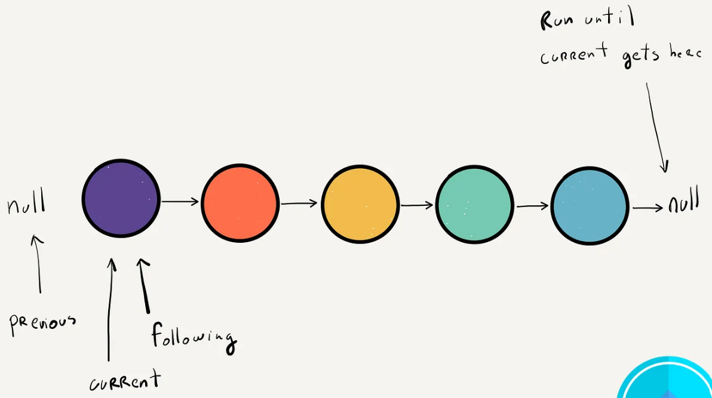

The third step is to figure out the order of operations so we don’t lose track of anything.

That while loop we just made won’t run unless we have at least one node. But once it does, the first thing we want to do is set following to following.next so we don’t lose track of what comes after current .

Remember, before this point following was equal to current.

```
function reverse(head) {
// Step 1
let previous = null
let current = head
let following = head
// Step 2
while(current !== null) {
following = following.next  // <===== 2a
}
}
```

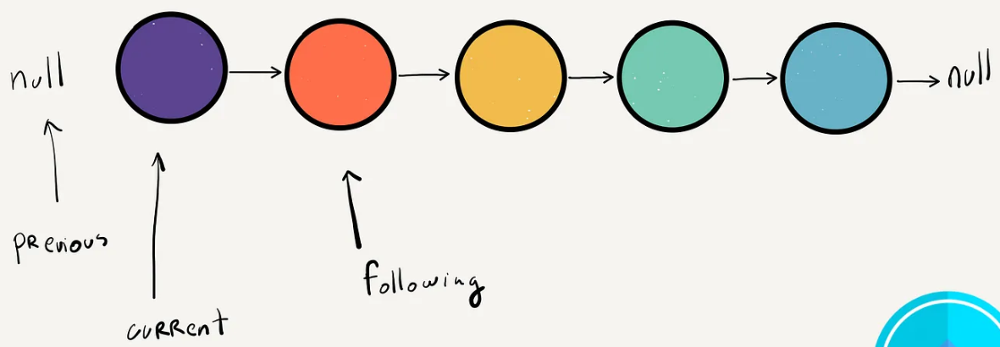

Then we want to do the reassignment of current.next , since we have all three pointers in place. This is the logic of actually reversing the linked list. We set current.next equal to previous , which at this point is equal to null .

```
function reverse(head) {
// Step 1
let previous = null
let current = head
let following = head
// Step 2
while(current !== null) {
following = following.next
current.next = previous      // <===== 2b
}
}
```
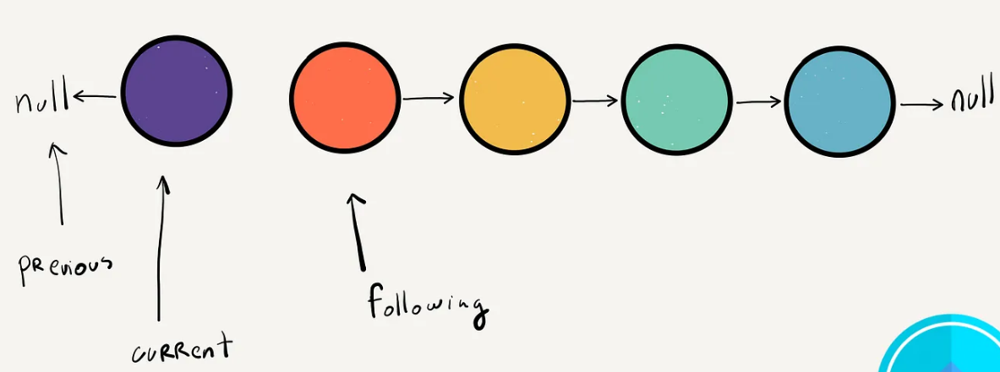
Once we’ve done that, we can move previous up to equal current , since we’re done with that node.

```
function reverse(head) {
// Step 1
let previous = null
let current = head
let following = head
// Step 2
while(current !== null) {
following = following.next
current.next = previous
previous = current          // <===== 2c
}
}
```


And then finally we can move current up by setting it equal to following .

```
function reverse(head) {
// Step 1
let previous = null
let current = head
let following = head
// Step 2
while(current !== null) {
following = following.next
current.next = previous
previous = current          
current = following         // <===== 2d
}
}
```

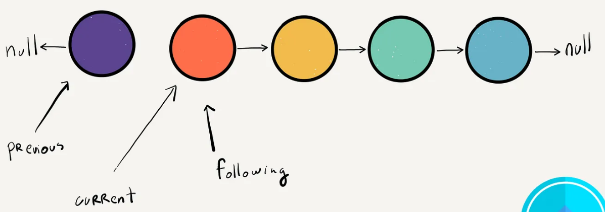

So to summarize those steps:

Set following equal to following.next
Set current.next equal to previous
Set previous equal to current
Set current equal to following

And that completes one round of reversals. We just need to apply these same operations then to every node until we reach the end of the list.

One way to think about what we’re doing, is that we’re looking at a small window around each node. We’re keeping track of the node before it so that we can point its next pointer to it. And we’re keeping track of the node after it so we don’t lose it and we can continue to move through the list.

Which brings us to our final step, on what to return.

Well following the diagram and code it should be pretty clear. Since the while loop is running as long as current is not null , then current must be null for us to break out of the loop. following also isn’t an option because at the end of a single loop, it’s equal to current .

Which means we’re going to be returning previous , since it’s pointing to the node right before current.

```
function reverse(head) {
// Step 1
let previous = null
let current = head
let following = head
// Step 2
while(current !== null) {
following = following.next
current.next = previous
previous = current          
current = following
}
// Step 3  
return previous
}
```

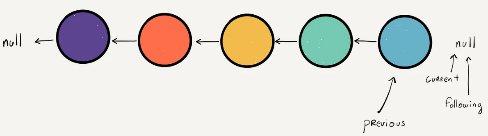